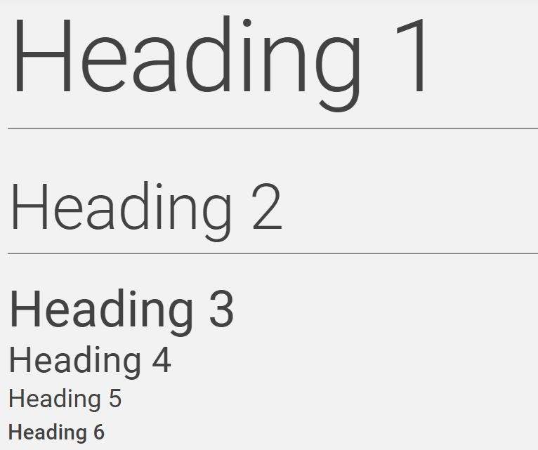
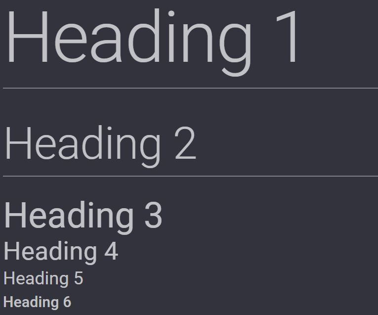
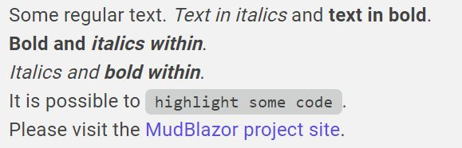
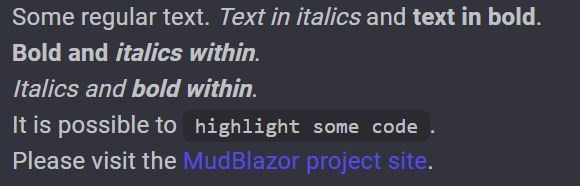
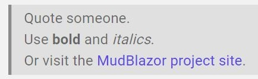
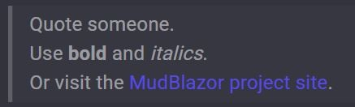
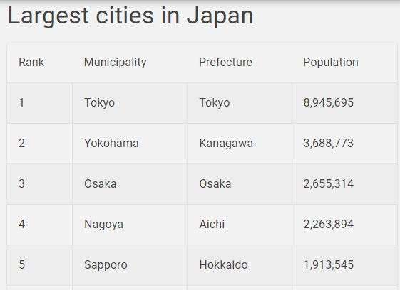
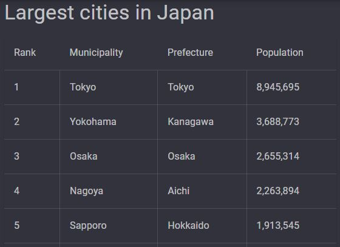

Light and dark themes are supported out-of-the-box. See [this post](https://mudblazor.com/customization/theming/overview) for steps how to toggle light and dark themes.
Or see WebAssembly or Server samples.
## Headers

## Regular text

## Quotation

## Lists

## Tables

