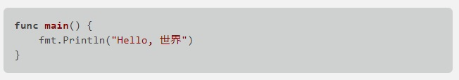
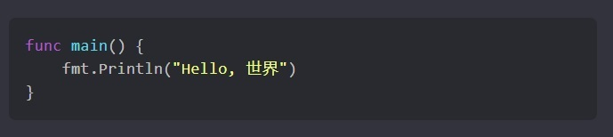

Light and dark themes are supported out-of-the-box. See [this post](https://mudblazor.com/customization/theming/overview) for steps how to toggle light and dark themes.
Or see WebAssembly or Server samples.
## Headers

## Regular text

## Quotation

## Lists

## Tables

## Code block
Code block theme-switching is not supported out-of-the-box.  
See [Server](https://github.com/MyNihongo/MudBlazor.Markdown/blob/main/samples/Server/App.razor) or [WebAssembly](https://github.com/MyNihongo/MudBlazor.Markdown/blob/main/samples/WebAssembly/App.razor) for examples.

